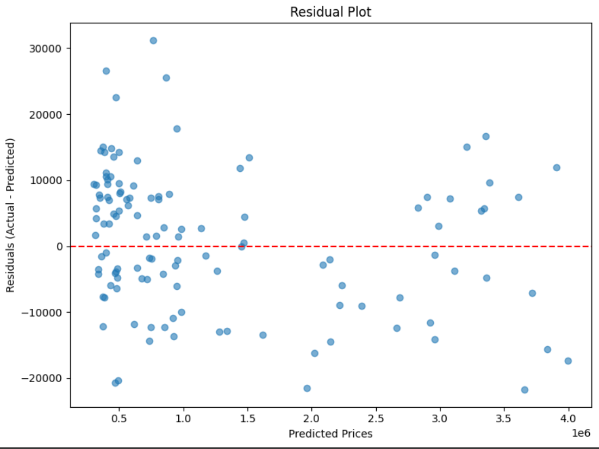
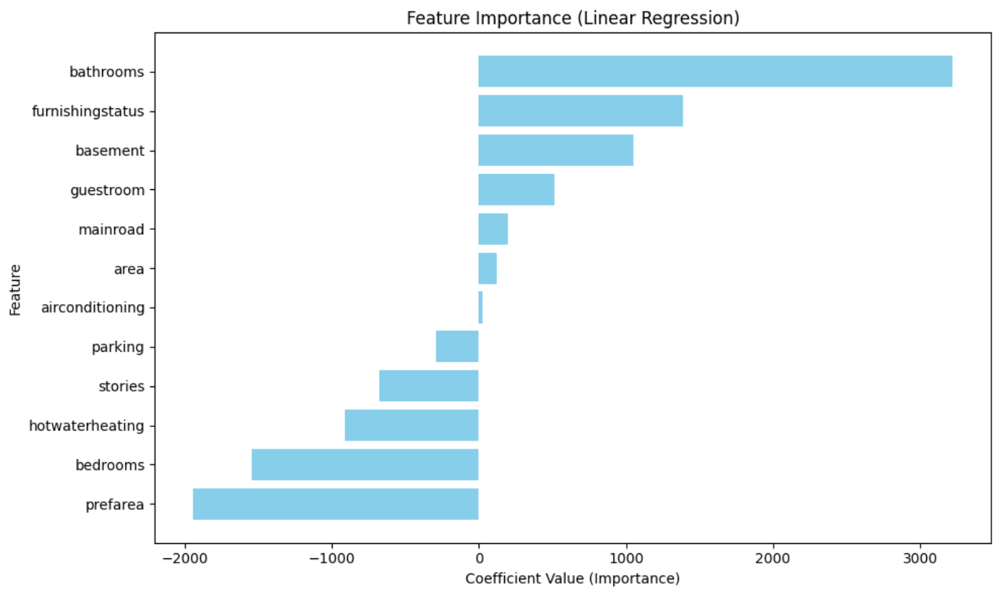

# House-Price-Prediction (Linear Regression)

This is a learning project that predicts house prices using a Linear Regression model. The app is deployed using Streamlit and allows users to input various house features to get an estimated cost.

Project Overview
----------------
The dataset is a synthetic dataset of 600 house records with features such as area, bedrooms, bathrooms, stories, and other housing features. Price tiers are categorized as Economy (below 500,000), Midscale (500,000–1,000,000), and Luxury (above 1,000,000). The model used is Linear Regression trained on the dataset with categorical features encoded using label encoders.

Features Used
-------------
Numeric features: Area, Bedrooms, Bathrooms, Stories, and Parking. 

Categorical features: Main road access, Guest room, Basement, Hot water heating, Air conditioning, Preferred area, and Furnishing status.

Files in Repository
-------------------
- streamlit_app.py: Streamlit web application
- linear_regression_large_housing_model.joblib: Joblib file containing trained model
- label_encoders.pkl: Encoders for categorical features
- housing_large_dataset.csv: Dataset used for training the model
- model_training.py: Script used to train the Linear Regression model
- requirements.txt: Packages required to be installed

Visualization Outputs
---------------------
To better understand the model’s performance and behavior, several visualizations were generated during analysis:

1. Residual Plot – Displays the difference between predicted and actual prices, helping visualize model error and bias.
  

2. Feature Importance Plot – Illustrates the relative weight or contribution of each feature in determining the predicted house price.

 
These plots assist in evaluating model accuracy, feature relationships, and areas for potential improvement.

Deployment
----------
The app is deployed online using Streamlit Cloud and can be accessed at: https://house-price-prediction-6tai5qkqgam6ge2ykk4rj8.streamlit.app

Model Performance
-----------------
During the training phase, the Linear Regression model achieved an R² score of 1.0 and an RMSE of approximately 10,615 on a synthetic dataset consisting of 600 samples. On an external house dataset consisting of 15 samples that was not used in training, the model achieved an R² score of 0.431 and an RMSE of approximately 106,696. These metrics show that the model fits the training data well and provides reasonable predictions on unseen houses, demonstrating its generalization ability.

